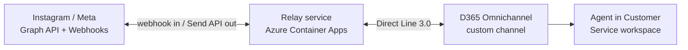

# Instagram channel for Dynamics 365 Omnichannel

Bring **Instagram Direct messages** into **Dynamics 365 Omnichannel for Customer Service** — even though Instagram is not an officially supported channel.

This package is a small **relay service** that sits between Instagram and Dynamics 365 and translates messages both ways. It is designed so a **non‑technical person can deploy it with one click** in the Azure portal: no code, no command line, no Docker.

---

## How it works

Dynamics 365 Omnichannel has no built‑in Instagram connector and no place to run custom code. The only supported way to add a channel is the **Direct Line custom messaging channel**, which needs a piece of middleware to talk to Instagram. That middleware is this relay, and it runs in **your own Azure subscription**.



* A customer sends an Instagram DM → Meta calls the relay's **webhook** → the relay opens a **Direct Line** conversation → it routes to an agent.
* The agent replies in Dynamics 365 → Direct Line delivers it to the relay → the relay calls the **Instagram Send API** → the customer sees the reply.

---

## Deploy it (the easy way)

> One‑time: an administrator publishes this repo and its prebuilt image once (see **Maintainer setup** below). After that, every customer uses the button.

### 1. Click the button

[](https://portal.azure.com/#blade/Microsoft_Azure_CreateUIDef/CustomDeploymentBlade/uri/https%3A%2F%2Fraw.githubusercontent.com%2Fmoliveirapinto%2Fd365-instagram-channel%2Fmain%2Finfra%2Fazuredeploy.json/createUIDefinitionUri/https%3A%2F%2Fraw.githubusercontent.com%2Fmoliveirapinto%2Fd365-instagram-channel%2Fmain%2Finfra%2FcreateUiDefinition.json)

### 2. Fill in the form

The portal opens a guided form. You only need five values:

| Field | Where it comes from |
| --- | --- |
| Instagram account ID (IG_ID) | Your Instagram professional account — see [docs/01-meta-setup.md](docs/01-meta-setup.md) |
| App Secret | Meta app → Settings → Basic |
| Webhook verify token | **Any** string you invent (you'll reuse it in Meta) |
| Instagram access token | Long‑lived Instagram User token |
| Direct Line secret | Dynamics 365 Omnichannel custom channel — see [docs/02-d365-setup.md](docs/02-d365-setup.md) |

### 3. Click **Review + create**

Azure builds everything (about 2–3 minutes).

### 4. Copy the webhook URL

When it finishes, open **Outputs** and copy **`webhookUrl`**. Paste it into the Meta webhook configuration (one box). Done.

That's the entire customer experience: **click → fill 5 boxes → copy 1 URL.**

---

## Setup guides

Follow these in order:

1. **[Meta / Instagram setup](docs/01-meta-setup.md)** — create the app, get the token, find your IG_ID.
2. **[Dynamics 365 setup](docs/02-d365-setup.md)** — register the custom channel, get the Direct Line secret, build a workstream.
3. **[Customer quickstart](docs/03-customer-quickstart.md)** — the short, screenshot‑driven version to hand to a customer.

---

## What gets created in Azure

| Resource | Purpose | Cost profile |
| --- | --- | --- |
| Container App | Runs the relay | Scales to a single small instance |
| Container Apps environment | Hosting environment | Shared |
| Log Analytics workspace | Logs / troubleshooting | Pay‑as‑you‑go, 30‑day retention |

Secrets are stored as **masked Container App secrets**, never as plain text.

---

## Maintainer setup (one time)

The "Deploy to Azure" button only works after the repo is **public** and the container image is published.

1. Push this repository to GitHub as a **public** repo named `d365-instagram-channel` under the owner referenced in the button URL.
2. The included GitHub Action ([.github/workflows/build-image.yml](.github/workflows/build-image.yml)) builds and publishes the image to **GHCR** on every push to `main`.
3. In the repo's **Packages** settings, make the published package **public** so customers can pull it without logging in.
4. Verify the raw URLs resolve:
   * `https://raw.githubusercontent.com/<owner>/d365-instagram-channel/main/infra/azuredeploy.json`
   * `https://raw.githubusercontent.com/<owner>/d365-instagram-channel/main/infra/createUiDefinition.json`

If you fork under a different owner, update the owner in the button URL above, in `containerImage` (in [infra/mainTemplate.bicep](infra/mainTemplate.bicep) and [infra/createUiDefinition.json](infra/createUiDefinition.json)), then recompile with `az bicep build --file infra/mainTemplate.bicep --outfile infra/azuredeploy.json`.

---

## Run locally (developers)

```bash
npm install
cp .env.example .env   # fill in the values
npm run build
npm start
```

Expose the local port with a tunnel (for example `dev tunnels` or `ngrok`) to receive Meta webhooks during development.

---

## Design notes & limits

* **Single replica.** The relay keeps the Instagram ↔ Direct Line conversation map in memory, so it runs as one instance (the Bicep pins `min = max = 1`). To scale out, swap [`src/store.ts`](src/store.ts) for a shared store (Cosmos DB / Table Storage / Redis) behind the same interface.
* **24‑hour window.** Instagram only allows replies within 24 hours of the customer's last message (Meta policy). Human‑agent message tags can extend this; not enabled by default.
* **Message types.** Text and simple media URLs are relayed both ways. Rich cards/templates are not mapped in this version.
* **Not an official Microsoft or Meta product.** Provided under the MIT license, as‑is.

---

## License

MIT — see [LICENSE](LICENSE).
